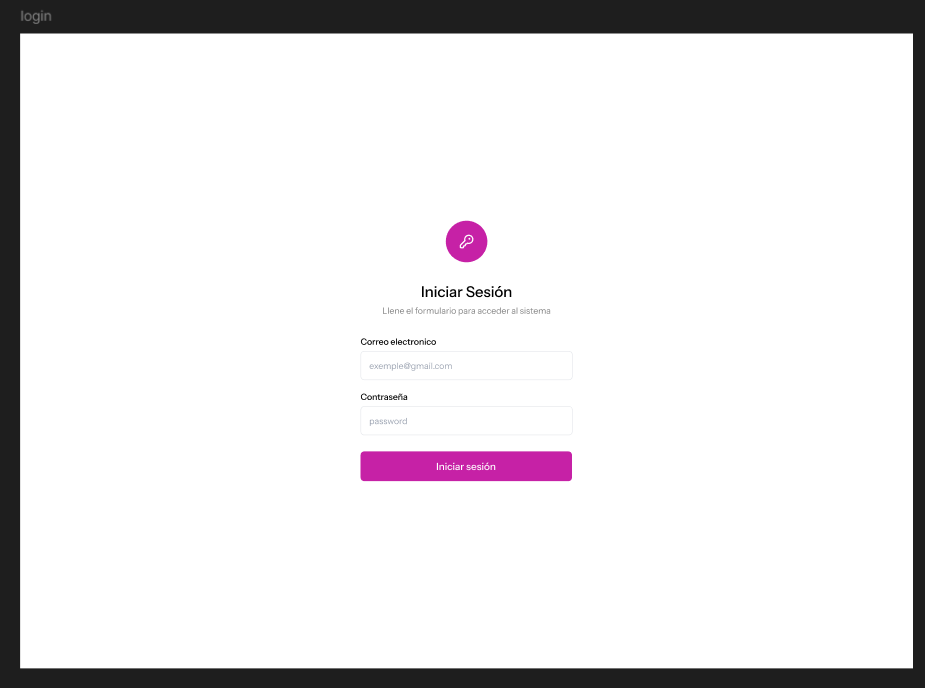
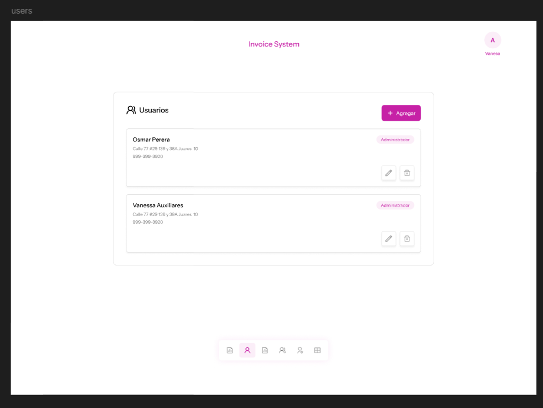
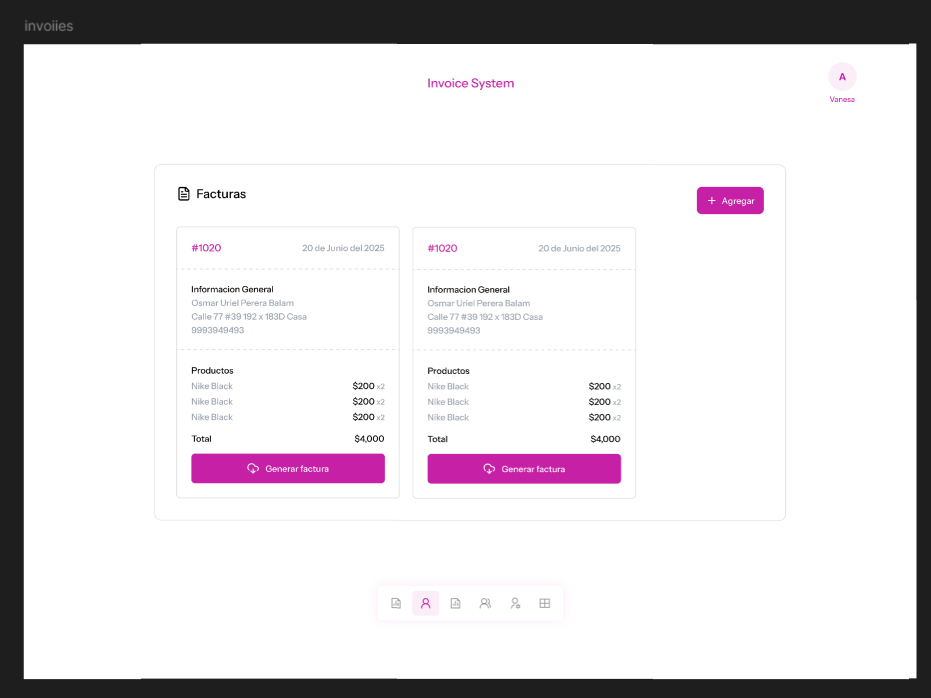
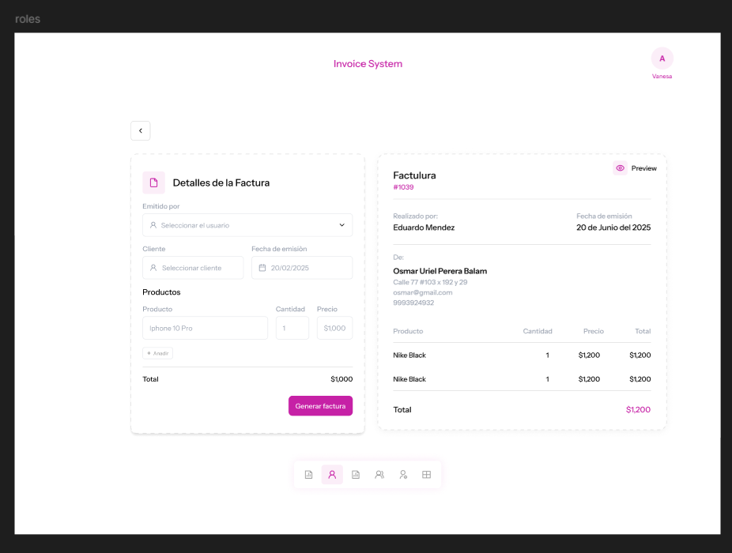
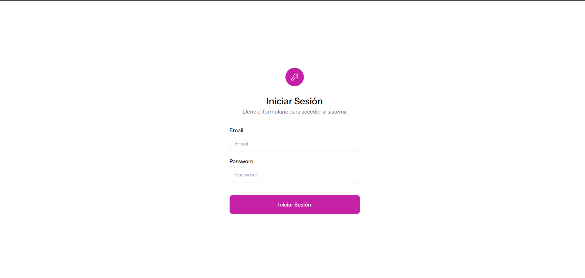
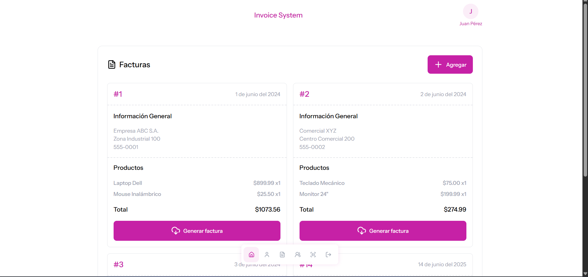
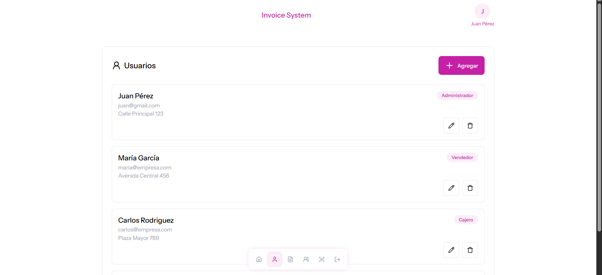

# 📋 Sistema de Facturación

Pequeño sistema de facturación diseñado como parte de un aprendizaje personal con el fin de tener nosion del diseño y desarrollo de este tipo de sistemas.  

## 🎯 Características Principales

- **Gestión completa de clientes** - Registro, edición y administración de información de clientes
- **Catálogo de productos** - Manejo de servicios y productos
- **Facturación automatizada** - Generación y personalización de facturas
- **Sistema de roles** - Control de acceso basado en permisos
- **Interfaz intuitiva** - Diseño responsive y fácil de usar


## 🛠️ Tecnologías Utilizadas

| Tecnología | Versión | Propósito |
|------------|---------|-----------|
| **PHP** | 7.4+ | Backend y lógica del servidor |
| **MySQL** | 5.7+ | Base de datos |
| **HTML5** | - | Estructura de páginas |
| **CSS3** | - | Estilos y diseño responsive |
| **JavaScript** | ES6+ | Interactividad del frontend |

## 📦 Módulos del Sistema

### 🔐 Autenticación
- **Inicio de sesión** - Autenticación segura de usuarios
- **Gestión de roles** - Asignación de permisos por nivel de usuario

### 💼 Administración
- **Usuarios** - Crear, editar y eliminar usuarios del sistema
- **Clientes** - Gestión completa de la base de clientes
- **Productos** - Catálogo de servicios y productos disponibles

### 📄 Facturación
- **Creación de facturas** - Generación de facturas personalizadas

## 🚀 Instalación

### Prerrequisitos
- PHP 7.4 o superior
- MySQL 5.7 o superior
- Servidor web (Apache/Nginx)
- Composer (opcional, para dependencias)

### Pasos de instalación

1. **Clonar el repositorio**
   ```bash
   git clone https://github.com/tu-usuario/invoice-system.git
   cd invoice-system
   ```

2. **Configurar la base de datos**
   ```sql
   CREATE DATABASE invoice_system;
   ```

3. **Importar el esquema de la base de datos**
   ```bash
   mysql -u usuario -p invoice_system < database/schema.sql
   ```

4. **Configurar las credenciales**
   ```php
   // config/database.php
   define('DB_HOST', 'localhost');
   define('DB_USER', 'tu_usuario');
   define('DB_PASS', 'tu_contraseña');
   define('DB_NAME', 'invoice_system');
   ```

5. **Configurar el servidor web**
   - Apuntar el document root a la carpeta `public/`
   - Habilitar mod_rewrite (Apache) o configurar URL rewriting (Nginx)


## 🔧 Uso del Sistema

### Acceso Inicial
- **URL:** `http://tu-dominio.com/login.php`
- **Usuario por defecto:** `admin@gmail.com`
- **Contraseña:** `123456`
portes** para análisis de ventas

## Diseño
Para el diseño se eligieron colores claros y grises con un color base que en este caso fue un rosado para darle un tono más suave y agradable para el usuario. No es algo tipico pero si algo diferente.

### Inicio de sesión


### Gestión de Usuarios


### Gestión de productos


### Facturación



## Capturas de pantalla de la aplicación

### Inicio de sesión


### Facturación


### Gestión de Usuarios

